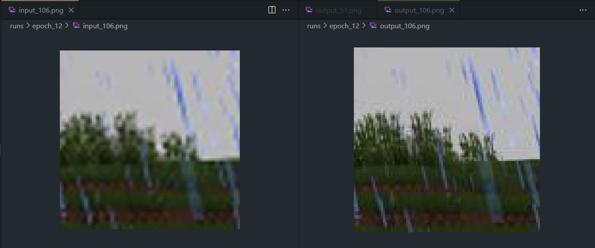
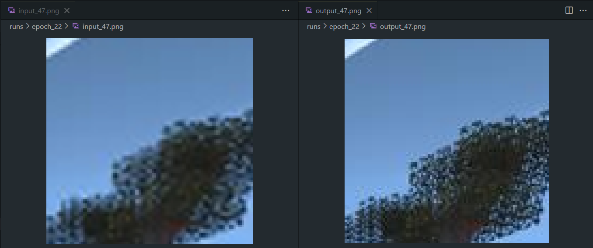

# FrameX: Super-Resolution Image Processing with PyTorch

## Overview

FrameX is a deep learning-based project designed to enhance low-resolution images into high-resolution ones using advanced image super-resolution techniques. This project leverages PyTorch, torchvision, and other Python libraries to create and train models for upscaling images. The project features a custom dataset pipeline, EDSR model implementation, and supports training and evaluation on GPUs.

For the purpose of this project, we worked solely with a dataset of 4k Minecraft Images, linked in the download.sh file.

### Hardware Used
This was trained on [NERSC PERLMUTTER](https://docs.nersc.gov/systems/perlmutter/architecture/) using the NVIDIA A100 platform.

### Training
We found that training for 30 Epochs was sufficient.

### Examples
Here are example images processed by FrameX:

- **Grass and Rain:**
  

- **Trees:**
  

## Project Structure

```
FrameX/
|-- Examples/               # Directory for sample datasets or code examples
|-- download.sh             # Script to download necessary datasets
|-- README.md               # Documentation for the project
|-- requirements.txt        # Python dependencies
|-- training.py             # Main script for training and evaluation
```

## Features

- **Custom Dataset Loader**: Dynamically loads and preprocesses image data for super-resolution tasks.
- **Super-Resolution Models**: Includes implementations for SRCNN and EDSR architectures.
- **Patch-Based Training**: Extracts image patches to optimize training and memory usage.
- **Efficient Training Pipeline**:
  - Utilizes GPU acceleration for faster training.
  - Implements mixed precision training using `torch.cuda.amp`.
- **Image Quality Metrics**:
  - Computes Peak Signal-to-Noise Ratio (PSNR) for evaluation.
- **Real-Time Visualization**: Saves intermediate input, output, and ground truth images during training.
- **Supports Large-Scale Datasets**: Designed to handle 4K and 8K images with efficient memory management.

## Requirements

The project requires Python and the following libraries:

### Installation

1. Clone the repository:
   ```bash
   git clone <repository_url>
   cd FrameX
   ```
2. Install dependencies:
   ```bash
   pip install -r requirements.txt
   ```
3. Download the dataset:
   ```bash
   bash download.sh
   ```

## Training

The `training.py` script supports end-to-end training and evaluation:

1. Modify the dataset directory and parameters in the script:
   ```python
   images_dir = "./dataset/images/"
   ```
2. Run the training script:
   ```bash
   python training.py
   ```
3. During training:
   - Training and validation losses are printed for each epoch.
   - PSNR values are calculated for quality assessment.
   - Model checkpoints and intermediate results are saved to the `./runs` directory.

## Dataset Preparation

Ensure that the image dataset is placed in the following structure:

```
dataset/
|-- images/
    |-- image1.jpg
    |-- image2.jpg
    ...
```

Images should be in `.jpg` format. The script automatically splits the dataset into training and testing sets.

## Model

### EDSR (Enhanced Deep Residual Networks)

- A deep and robust architecture leveraging residual blocks.
- Features:
  - Residual scaling for stability.
  - Adjustable number of residual blocks and features.

## Key Hyperparameters

- **Patch Size**: Default is 96x96 for image patches.
- **Learning Rate**: Default is `1e-4` with Adam optimizer.
- **Epochs**: Default is 30.
- **Batch Size**: Default is 128.

## Outputs

- **Intermediate Outputs**: Randomly selected input, output, and ground truth images are saved in the `runs/` directory.
- **Model Checkpoints**: Saved every 5 epochs in the root directory.
- **Final Model**: Saved as `srcnn_model.pth`.

## Evaluation

Evaluation is done on a test dataset to compute PSNR and save reconstructed high-resolution images. To test a single image:

1. Modify the test dataset path.
2. Run inference directly on the trained model.

## Example Usage

Example to visualize random patches during training:

```python
sample_batch = next(iter(train_dataloader))
sample_input, sample_target = sample_batch
print(sample_input.shape, sample_target.shape)
```

## Future Enhancements

- Add SSIM (Structural Similarity Index) for quality evaluation.
- Extend support for multi-scale super-resolution.
- Implement GAN-based super-resolution techniques (e.g., SRGAN).

## Contributors

Ruben Alias

